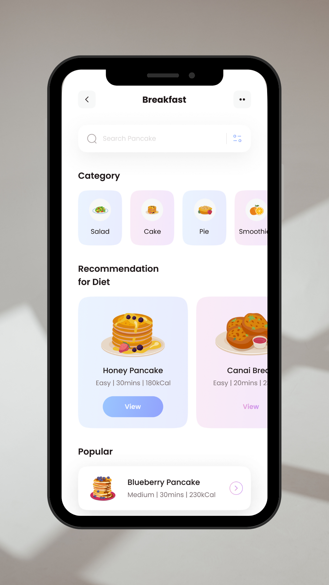

# 🏋️‍♂️ Fitness app - Votre guide nutritionnel 📱

Bienvenue dans **Fitness app** ! Une application Flutter moderne qui vous aide à explorer différentes catégories de régimes, obtenir des recommandations et découvrir les plans alimentaires populaires. 🍽️✨

## 🚀 Fonctionnalités principales

✅ **Recherche intuitive** 🔍 – Trouvez rapidement des régimes adaptés à vos besoins.\
✅ **Catégories variées** 📂 – Découvrez plusieurs types de régimes en fonction de vos objectifs.\
✅ **Recommandations personnalisées** 🏆 – Obtenez des suggestions basées sur les tendances et vos préférences.\
✅ **Régimes populaires** 🔥 – Accédez aux régimes les plus appréciés avec des détails comme le niveau, la durée et les calories.

## 🎨 Aperçu de l'interface



## 🛠️ Technologies utilisées

- **Flutter** 🦋 – Pour une expérience mobile rapide et fluide.
- **Dart** 🎯 – Langage puissant pour le développement mobile.
- **Flutter SVG** 🖼️ – Pour des icônes vectorielles élégantes et dynamiques.

## 📥 Installation

1. Clonez ce dépôt :
   ```bash
   git clone https://github.com/ethan-frot/Fitness-app
   ```
2. Accédez au dossier du projet :
   ```bash
   cd Fitness-app
   ```
3. Installez les dépendances :
   ```bash
   flutter pub get
   ```
4. Suivez le guide officiel de Flutter pour exécuter une application :  
   👉 [Guide d'installation et exécution Flutter](https://docs.flutter.dev/get-started/install)
5. Lancez l'application :
   ```bash
   flutter run
   ```

## 🎯 Objectif

Cette application est une **introduction à Flutter**, permettant de découvrir les bases du framework à travers une interface statique et bien conçue. Elle ne contient pas de logique métier avancée, mais sert de point de départ pour apprendre à structurer une application Flutter. 📚🚀
